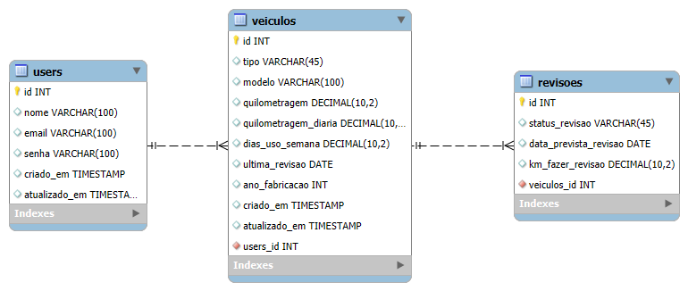

# 🚗 Sistema de Revisão Preditiva de Veículos

## 📌 Sobre o Projeto
Este projeto é um **Sistema de Manutenção Preditiva de Veículos** desenvolvido com:
- **MySQL** para banco de dados, incluindo **Procedures** e **Triggers** para automação de processos;
- **Spring Boot (Java)** para criação da **API REST**, conectando o backend ao banco de dados.

O objetivo é prever e gerenciar manutenções, garantindo maior eficiência e segurança na gestão de veículos.

---

## 🛠️ Tecnologias Utilizadas
- **Java** (Spring Boot)
- **MySQL**
- **Procedures** e **Triggers**
- **Maven**
- **Hibernate / JPA**
- **Postman** (para testes da API)

---

## 🖼️ Diagrama ERR

---

## 👨‍💻 Autor
- Maykon Silva Carvalho
- Graduando em Sistemas de Informação - UFRA
- [Linkedin](https://www.linkedin.com/in/maykon-carvalho-329853208) | [GitHub](https://github.com/carvalhomaykon)
